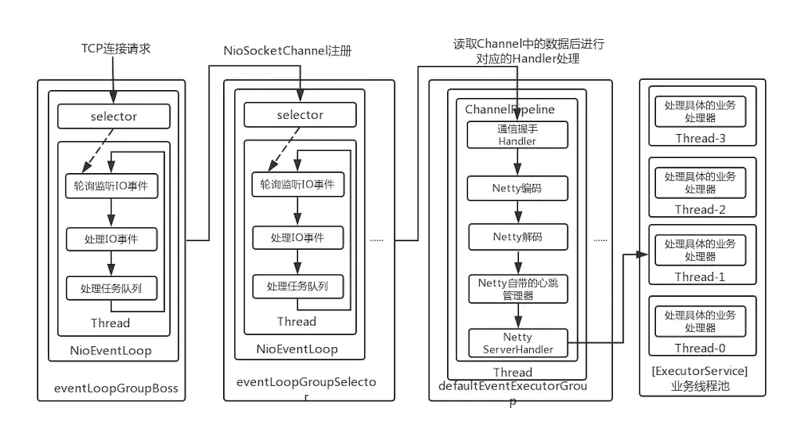

### 本工程为学习RocketMQ的Reactor多线程设计

#### Reactor多线程设计

上面的框图中可以大致了解RocketMQ中NettyRemotingServer的Reactor 多线程模型。一个 Reactor 主线程（eventLoopGroupBoss，即为上面的1）负责监听 TCP网络连接请求，建立好连接，创建SocketChannel，并注册到selector上。RocketMQ的源码中会自动根据OS的类型选择NIO和Epoll，也可以通过参数配置）,然后监听真正的网络数据。拿到网络数据后，再丢给Worker线程池（eventLoopGroupSelector，即为上面的“N”，源码中默认设置为3），在真正执行业务逻辑之前需要进行SSL验证、编解码、空闲检查、网络连接管理，这些工作交给defaultEventExecutorGroup（即为上面的“M1”，源码中默认设置为8）去做。而处理业务操作放在业务线程池中执行，根据 RomotingCommand 的业务请求码code去processorTable这个本地缓存变量中找到对应的 processor，然后封装成task任务后，提交给对应的业务processor处理线程池来执行（sendMessageExecutor，以发送消息为例，即为上面的 “M2”）。从入口到业务逻辑的几个步骤中线程池一直再增加，这跟每一步逻辑复杂性相关，越复杂，需要的并发通道越宽。

线程数 | 线程名 | 线程具体说明
 --- | --- | --- 
1 | NettyBoss_%d | Reactor 主线程
N | NettyServerEPOLLSelector_%d_%d | Reactor 线程池
M1 | NettyServerCodecThread_%d | Worker线程池
M2 | RemotingExecutorThread_%d | 业务processor处理线程池

